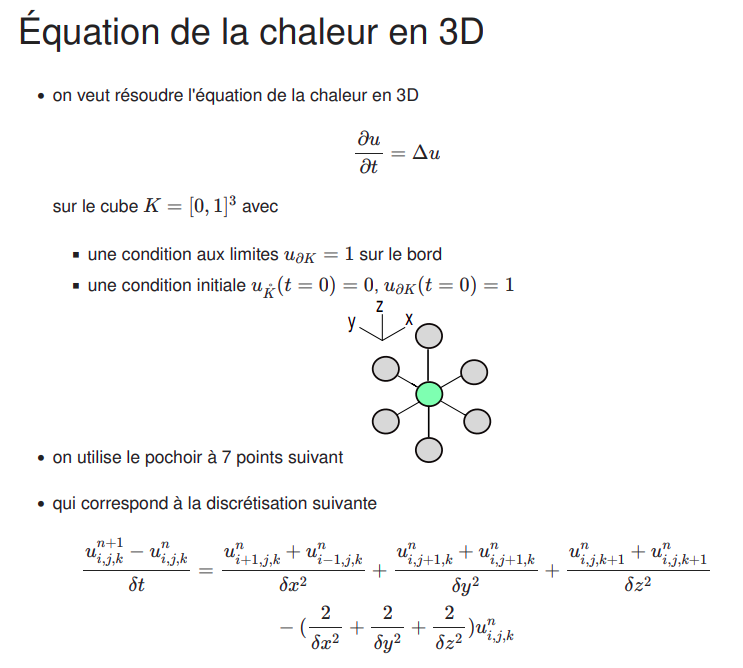

# 3D Heat Equation Solver - Using GPU


# Run solvers

If you want to test and compare CPU and GPU solvers:    
``` bash
make && heatTest.x
```

To compile and run CPU solver:    
``` bash
make && mainCPU.x
```

To compile and run GPU solver:    
``` bash
make && mainGPU.x
```

-> ***Solutions will be saved in VTK files format.***